# 第一章 计算机系统概述


> **如何考这方面内容?**
> *   **基本概念**: 冯诺依曼计算机结构的五个特点、程序编译的执行过程
> *   **性能指标的计算**: CPI (每个指令执行需要的时钟周期数)、IPS (每秒执行的指令数)

用一个例子来讲解机组学什么内容，这里有一个 C 文件 `hello.c`:

```c
#include <stdio.h>
int main(){
  printf("hello world");
  return 0;
}
```

这个文件是存放在硬盘中的。在目录下执行 `gcc -o hello hello.c` 就会生成 `hello.exe` 的可执行程序。
这个文件当中存放的是一系列指令。
当我们直接使用 `hello.exe` 命令执行它，计算机内部是这样执行程序的:

1.  在键盘中输入 "hello.exe" 时，这个字符串会暂时存放在键盘控制器。
2.  命令解释程序 (sh/cmd) 会通过总线将字符串读入到 CPU 的寄存器中。
3.  CPU 再通过总线把字符串存入到主寄存器中 (内存条中)。
    *   在主存中有很多存储单元，每个存储单元都有他的地址。
4.  命令解释程序会从硬盘中加载 `hello.exe` 程序, 通过总线把当中的指令加载到主存中。
5.  CPU 会从第一条指令开始，通过存储单元地址依次执行指令。
6.  CPU 会经过一系列指令把 "hello world" 这个字符串通过总线送到图形控制器中将数据显示出来。

目前可以把主存理解为字节数组:

| 下标 | 数据 |
| :--- | :--- |
| 0 | 01101000 |
| 1 | 01101001 |
| 2 | 01101010 |
| 3 | 01101110 |

## 进制转换

*   **二进制转十进制**: `01101000` = 0 × 2^8 + 1 × 2^7 + 1 × 2^6 + ... = 26729
    *   `1001B`：后缀为 B, 这是个二进制数。

*   **十进制转二进制**: 方法是除基取余，上右下左。

    

*   **16 -> 2**: 可以使用 4 个二进制位来表示一个十六进制位。

*   **16 -> 10**: 按权展开 (H 是十六进制的标志)。

    ```text
    13DH = 1*(16^2) + 3*(16^1) + D*(16^0) = 317
    ```

*   **10 -> 16**: 同 10 转 2。

## 指令的设计和执行过程

一条指令包括 **操作码 + 地址码**。

例如: `0000 0011 0000 0110` 这条指令的前四位 `0000` 是操作码，剩下的是地址码。

我们可以定义一个表来表示所有操作码是做什么的:

| 操作码 | 操作类型 |
| :--- | :--- |
| 0000 | 取数指令 |
| 0001 | 存数指令 |
| 0010 | 加法操作 |
| 0011 | 乘法操作 |
| 0100 | 打印操作 |
| 0101 | 停机操作 |
| ... | .... |

如果我们想把主存地址为 7 的储存单元中的数据加载到 1 号寄存器中，就可以使用这个指令: `0000 0001 0000 0111`

*   `0000`: 取数指令
*   `0001`: 目的地址码 (表示加载到地址为 1 的寄存器中)
*   `0000 0111`: 源操作数地址码 (表示从主存地址为 7 的地方取数)

---

假设我们要计算 `ax + b` 的结果:
*   `a` 的值为 5, 地址为 `0001 0010B`
*   `x` 的值为 6, 地址为 `0001 0011B`
*   `b` 的值为 12, 地址为 `0001 0100B`

需要执行如下操作:

1.  **取数**，将 `a` 放到 0 号寄存器
    ```text
    0000 0000 0001 0010
    ```
2.  **取数**，将 `x` 放到 1 号寄存器
    ```text
    0000 0001 0001 0011
    ```
3.  **乘法**，将 0 号寄存器和 1 号寄存器的值进行乘法操作，结果存到 0 号寄存器
    ```text
    0011 0000 0000 0001
    ```
4.  **取数**，将 `b` 放到 1 号寄存器
    ```text
    0000 0001 0001 0100
    ```
5.  **加法**，将 0 号寄存器和 1 号进行加法操作，结果放到 0 号寄存器中
    ```text
    0010 0000 0000 0001
    ```
6.  **存数**，将 0 号寄存器的值存入到地址为 `0001 0101` 的存储单元中
    ```text
    0001 0001 0101 0000
    ```
    (目的地址码 `0001 0101` 要在源地址码的前面)

---

CPU 是通过**内存总线**和**主存**相连的，实际上这个总线还可以细分，一共有三类总线:
*   **地址总线**
*   **控制总线**
*   **数据总线**

CPU 内部还有：
*   **通用寄存器组**
*   **专用寄存器**: 程序计数器 (PC)、指令寄存器 (IR)、内存地址寄存器 (MAR)、内存数据寄存器 (MDR)
*   **算术逻辑单元 (ALU)**: 对数据进行运算操作
*   **控制单元 (AU)**: 用于解释主存中的指令，并发出各种操作命令

知道这些之后就可以把上面的程序执行流程更加细化:

**第一条指令（取数，将 `a` 放到 0 号寄存器 `0000 0000 0001 0010`）：**

1.  当程序的指令被加载到内存之后，会将程序的第一条指令的地址加载到 **PC** 寄存器中。
2.  控制单元 **AU** 就会同时给 **PC** 和 **MAR** 发送控制信号，把 **PC** 中的地址传送到 **MAR** 中。
3.  **MAR** 中的内存地址会通过地址总线直接送到主存中。
4.  控制单元 **AU** 会通过控制总线给主存发送读数据的信号。
5.  主存将内存地址中的数据（这个数据其实是写程序编译成的指令）准备好后，通过数据总线传送给 **MDR**。
6.  控制单元 **AU** 会分别给 **MDR** 和 **IR** 发送控制信号，将 **MDR** 中存放的指令存放到 **IR** 中。（此时完成了取出第一条指令的操作）
7.  控制单元 **AU** 将 **PC** 的值加 1 或者加 2，这样 **PC** 的值就会变成下一条要执行的指令的地址。
8.  控制单元会分析 **IR** 中的指令的操作码，读取到是 `0000` (取数操作)。
9.  控制单元分别给 **IR** 和 **MAR** 发送控制信号，将指令中的源操作数的内存地址传输给 **MAR**，**MAR** 将源操作数的内存地址送到主存储器中，控制单元再给主存储器发送读数的控制信号。
10. 主存将对应内存地址的数据准备好后通过数据总线把数据传送给 **MDR** (这里的数据就是需要进行运算操作的数字了)。
11. **AU** 同时给通用寄存器组和 **MDR** 发送控制信号，将 **MDR** 中的数据传输到 0 号寄存器 (**IR** 中的指令中的目的地址码为 `0000`)。

到此才完成了第一条指令的取数操作。第二条指令也是同理。

**第三条指令（乘法，将 0 号寄存器和 1 号寄存器的值进行乘法操作，结果存到 0 号寄存器）：**

> 此时 **PC** 指向第三条指令的地址, 并且 `a` 的值已经存到了 0 号寄存器中，`x` 的值已经存到了 1 号寄存器中。

1.  **AU** 向 **PC** 和 **MAR** 发送控制信号，将 **PC** 中的地址传送到 **MAR** 中。
2.  **MAR** 通过地址总线把地址送到主存中。
3.  **AU** 会通过控制总线发送信号告诉主存读取数据，主存读取该地址中存放的指令，将该指令存放到 **MDR**。
4.  **AU** 向 **IR** 和 **MDR** 发送信号，让 **MDR** 将数据放到 **IR** 中，这时 **PC** 会自动增加移动到下一条指令的地址。
5.  **AU** 读取 **IR** 中存放的指令的操作码，发现是乘法操作。
6.  **AU** 给通用寄存器组和 **ALU** 同时发送控制信号（给 **ALU** 发送的是乘法信号，将 0 号寄存器和 1 号寄存器中的值相乘，结果存到 0 号）。

此时就完成了第三条指令的乘法操作。
...

> **总结一下整个过程**:
> 1.  第一步都是根据 **PC** 取出指令到 **IR**（取完之后 **PC** 自动 +1）。
> 2.  第二步进行指令译码并送出控制信号。
> 3.  第三步根据不同的操作码调用不同的组件和控制信号完成指定操作。

## 冯·诺依曼计算机结构的 5 个特点

1.  计算机由**运算器**、**控制器**、**存储器**、**输入设备**和**输出设备** 5 个基本部件组成。
2.  指令和数据以同等地位存储在存储器中，形式上没有区别，但计算机应能区分它们。
3.  指令和数据均用二进制代码表示。
4.  指令由**操作码**和**操作数**组成两部分组成，操作数可以是多个。
5.  采用“**存储程序**”工作方式。

## 程序编译执行过程

按照之前的规则计算表达式 `ax + b` 的二进制程序：

```text
0000 0000 0001 0010
0000 0001 0001 0011
0011 0000 0000 0001
0000 0001 0001 0100
0010 0000 0000 0001
0001 0001 0101 0000
```

它转换成汇编代码：

```asm
LOAD RO 12H
LOAD R1 13H
MUL RO RO R1
LOAD R1 14H
ADD RO RO R1
STORE 15H RO
```

但是计算机不能够直接识别这样的汇编代码，而是需要**汇编器**。

**汇编代码特点**:
*   可移植性是比较差的，因为别的机器中的指令不一定和当前环境一样。
*   编写难度高，需要程序员非常熟悉机器的内部结构。

**编译器**：将高级语言程序一次性翻译成机器语言程序。

**C 语言程序编译的过程**:
1.  **预处理**：修改原始 C 程序，将 `hello.c` -> `hello.i` (文本)。
2.  **编译**：将 `hello.i` 编译成汇编程序 `hello.s` (文本)。
3.  **汇编**: 将 `hello.s` -> 可重定位目标程序 `hello.o` (二进制)。
4.  **链接**: 最终链接成为可执行的二进制程序。

**解释器**：将程序中的语句按执行顺序逐行翻译成机器指令并**立即执行**。

## 计算机系统的两个体系结构

在操作系统和功能部件之间有两个体系结构：

*   **指令集体系结构 (ISA)**: 对指令系统的规定或指令的规范，是软件和硬件直接的接口。
    *   定义了一台计算机可以执行的所有指令的集合。
    *   规定每条指令对应计算机执行什么操作。
    *   指令处理的操作数存放位置。
*   **微体系结构**: 对 ISA 的具体逻辑实现，关注于内部硬件设计的实现细节。
    *   指令流水线设计。
    *   加法器使用串行进位还是并行进位。
    *   存储器结构。
    *   ...

## 计算机性能

**三种性能指标：**

1.  **时钟周期**
    假设执行 1 条指令需要 5 个时钟周期，1 个时钟周期是 20ns，执行一条指令就需要 100ns。
    
    > CPU 时钟周期越短，执行速度越快。
    
2.  **时钟频率 (主频)**: 一秒内有多少时钟周期。
    主频 = 1 / 时钟周期
    若 1 个时钟周期是 10ns, 则一秒内有 1s / 10ns = 10^8 个时钟周期。
    主频 = 10^8 Hz = 10^5 kHz = 10^2 MHz = 0.1 GHz
    
    > 主频越大，CPU 执行速度越快。
    
3.  **CPI**: 执行一条指令需要的时钟周期数。
    比如一条取址指令，花费了 5 个时钟周期来执行，则它的 CPI 是 5。
    对于一个程序，有很多指令，所以 CPI 是一个平均值。

**CPU 总执行时间**:
总指令条数 × CPI × 时钟周期

**三种评估方法：**

1.  **指令执行速度**
    *   **IPS**: 平均每秒执行多少条指令。
        一条指令执行平均时间 = 平均 CPI × 时钟周期
        IPS = 1 / (平均 CPI × 时钟周期) = 主频 / 平均 CPI
    *   **MIPS**: 平均每秒执行多少百万条指令。
        MIPS = IPS / 10^6 = 1 / (平均 CPI × 时钟周期 × 10^6) = 主频 / (平均 CPI × 10^6)
    *   **FIPS**: 平均每秒执行多少次浮点运算操作。

2.  **基准程序**
    计算指定基准程序，在多台计算机中执行并计时。

3.  **Amdahl 定律 (Amdahl's Law)**

    

# 第二章 总线系统

## 单总线系统和多总线系统

在小型或者微型计算机中，多采用**单总线系统**，所有设备都使用一根总线进行通信，但由于同一时间只能有一个设备能通过总线和 CPU 通信，所以当设备多的时候单总线系统的弊大于利。

所以就出现了**多总线系统**，它将所有设备的速度进行分层，差异大的放在不同总线，差不多速度的用一个总线： 存储器总线、IO 总线。

最后再使用一个通道，连接存储器总线 and IO 总线。

## 总线的通用属性

*   **总线带宽**： 总线的最大数据传输率（单位时间内最多可以发送的数据量）。
*   **总线宽度**： 如果是串行传输，宽度为 1, 如果是并行传输，宽度为并行的通道个数。
*   **存储器总线的内部结构**：

    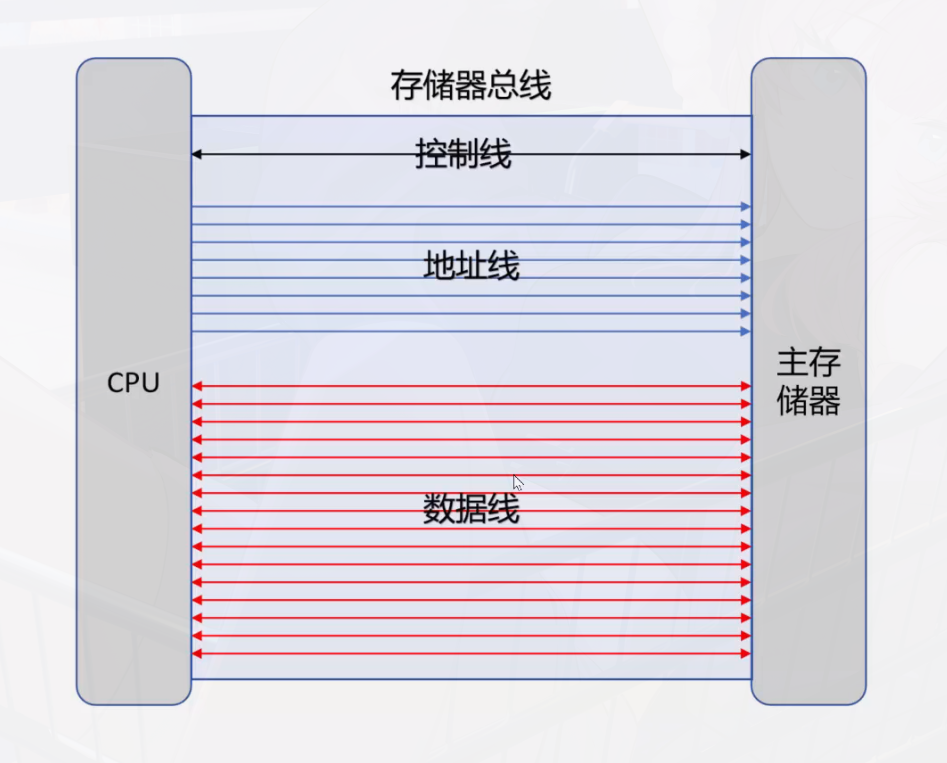

    > 若一个总线周期传送一次数据，则总线带宽 = 总线宽度 × (1 / 总线时钟周期) = 总线宽度 × 总线时钟频率
    > 
    > 总线带宽 = 总线宽度 × 总线工作频率

## 什么是总线仲裁

主设备对总线有控制权，从设备没有。

主设备如果控制从设备，首先要先向总线控制器发送总线请求信号，得到总线同意信号后，才能拿到总线的控制权，才能通过总线控制从设备。

如果有多个主设备同时想要拿到总线控制权，则需要总线控制器进行**总线仲裁**。

仲裁的逻辑就是按照某个优先级顺序确定哪一个主设备可以使用总线。

**仲裁有两种方式：**

*   **集中式仲裁**
    *   **链式查询方式**：离总线控制器越近优先级越高。
        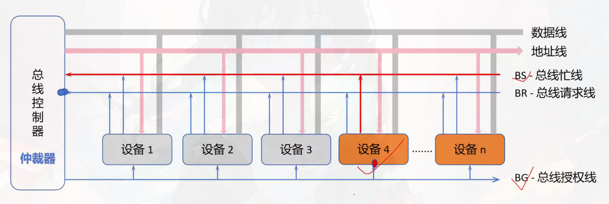
    *   **计数器定时查询**
    *   **独立请求方式**
*   **分布式仲裁**

##  总线定时的四种方法

*   **同步定时**：适用于总线长度较短，各设备存取时间比较接近的情况。
*   **异步定时**：允许总线上的设备存储时间不一致。


## 总线数据传输方式

CPU和主存之间是采用并行传输的（因为他们当中有多条数据线）

CPU和主存之间既可以采用同步通信(同步并行通信)也可以采用异步通信（异步并行通信）


同步串行通信：两个设备之间使用一条数据线，数据一位一位传输，并且两个设备使用同步的方式（根据总线的时钟信号来同步）


**重要** 异步串行通信：

奇校验：发送方先检查发的数据中1的个数，如果是奇数就直接发，如果是偶数就把校验位改成1,接收方接收数据如果1的个数为奇数就说明没问题

偶校验：同理


考点：

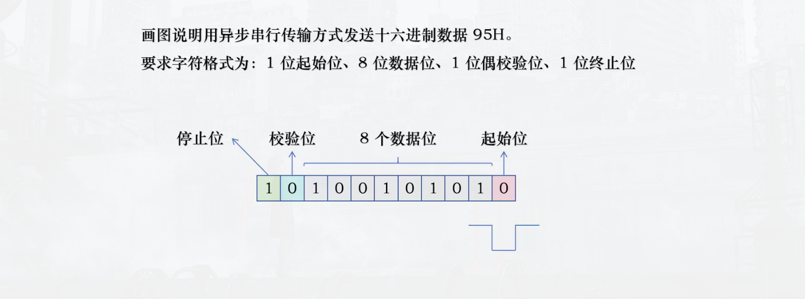


波特率：单位时间内传输二进制数据的位数

eg. 在串行异步传输系统中，假设每秒传输120个数据帧，其字符格式包括1个起始位，7个数据位，1个及偶校验位，1个停止位，计算波特率


(1 + 7 + 1 + 1) x 120 = 1200 bps 


## 总线突发传输

总线突发传输是一种通过单次地址周期后连续传输多个数据单元的机制，旨在提高数据传输效率。


# 第三章 主存储器

> 408如何考这一章的内容:
> 选择大题都会考
> 半导体存储芯片 RAM ROM的概念
> 主存扩展 计算芯片的数量、 地址范围
> 高速缓存 计算
> 多模块主存储器 理解原理
> 主存带宽的计算
> 存储校验 海明码（计网考


## 补一补数字电路基础
非门电路 逻辑表达式为： F = 非A
或门电路 F = A + B(逻辑和)
与门电路 F = A . B(逻辑积)
异或门电路 F = A^B

输出的逻辑表达式，如果比较复杂一般都用乘积和来表示
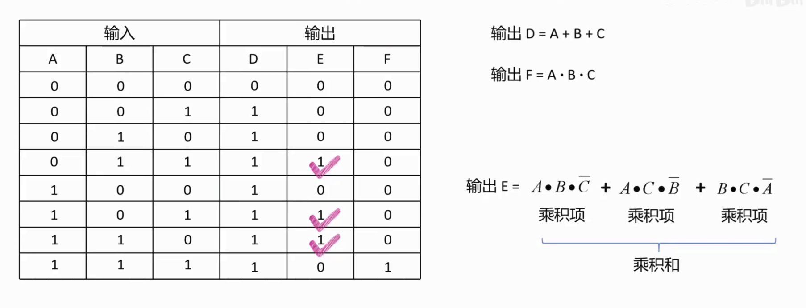

* 存储单元电路： 在数字电路中，可以存储一个二进制位的器件称为存储单元电路
* * 锁存器
* * 触发器


译码器： 将n个输入变量转换为2^n个输出线中的某一条有效信号（通常低电平有效）
> 必背3-8译码器  3个输入端   8个输出端
> eg. 输入101 (即5) 则第五个输出通道输出0 其余输出1
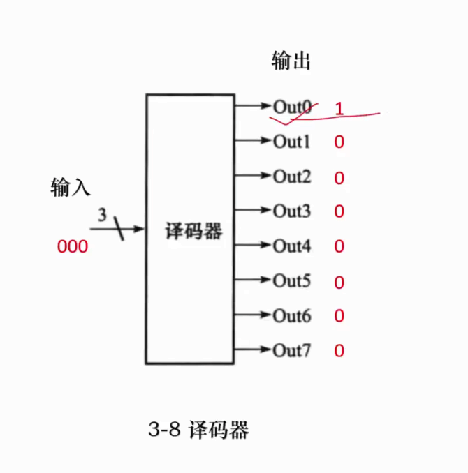

多路选择器（简称MUX)： 根据选择控制信号，从多路数据输入中选出一路送到输出端。

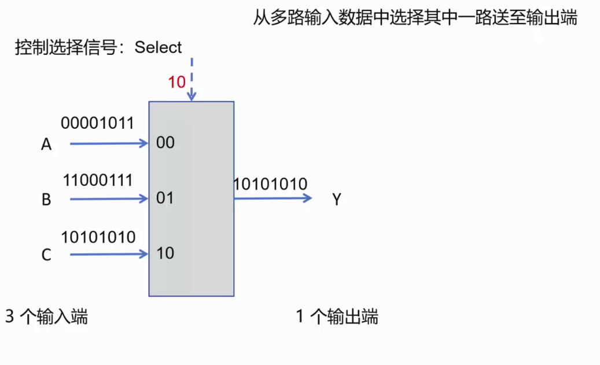


锁存器，用稳定的1状态和稳定的0状态来存储二进制0和1


门控d锁存器是通过一个控制信号C来控制读取二进制位和保存二进制位的，0读取，1保存，

在计算机系统中，这个控制信号一般为CPU的时钟信号，当高电平的时候锁存器是允许保存数据的，低电平的时候允许读取。这样的锁存器叫做D触发器


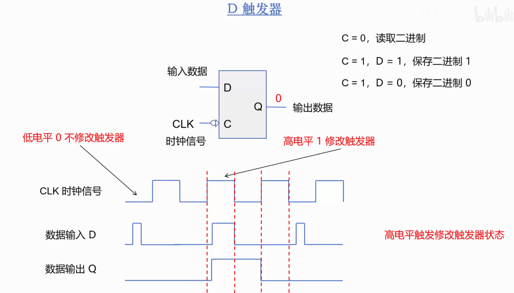


这样的结构当输入数据在高电平的时候不断的改变，会导致在高电平的时候输出也会不断改变，这是不稳定的


改进：规定在时钟周期的“下降沿”的时候的输入数据修改为输出数据，（高电平的下降沿之前不做修改）

改进后的触发器称为“边沿D触发器”


> 寄存器就是由很多边沿D触发器构成的

通用寄存器的结构:

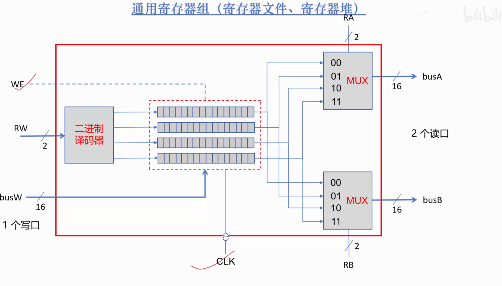


> 重要概念：
>
> 机器字长：CPU一次能处理数据的位数，通常与寄存器位数有关


### 主存储器

主存分为（1）只读存储器ROM （随机存取存储器）RAM

> 在计算机内部，数据大小的转换单位是2的10次方：1024B = 1KB
>
> 但在数据通信领域，数据的转换单位是1000： 1TB = 1000GB 1GB = 1000MB

* MaskROM: 它的信息（二极管）是在制造的时候就确定的，所以在正常的使用中只能读取数据

通常用来存储不经常改变的信息

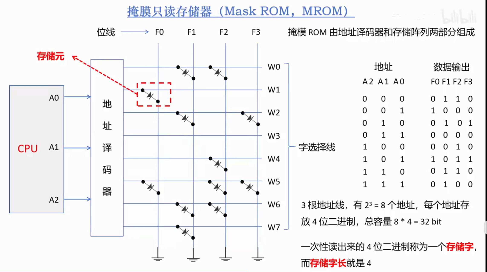

* RAM 随机存取存储器

什么是随机： 随机的意思就是按照地址访问存储单元。ROM就属于随机只读存储器

存储阵列可以有很多个芯片，比如有8个，每次存取就会根据行地址和列地址两个译码器出来的地址，同时给8个存储芯片对应的地址存取数据，这样就能一次性操作8位二进制

行地址和列地址来自MAR

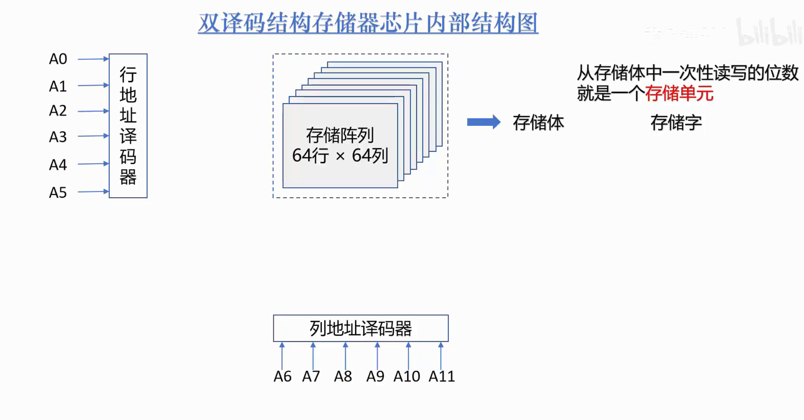


### 主存储器如何与CPU连接

* 如何计算存储器容量？

存储容量 = 存储字数量 x 存储字长

eg.一个RAM中的存储体有四个存储芯片，则存储字长为4，行地址有11位列地址也有11位，则可表示的地址数量为 2^22个，则存储字数量为2^22个 (4M).

存储容量 = 4bit x 4M = 0.5B x 4M = 2MB

* 主存与CPU如何连接？

CPU通过主存控制器（行地址缓冲器、列地址缓冲器、刷新计数器.....）来访问主存

主存控制器作用总结：

（1）将CPU中MAR送出的地址拆分成行地址和列地址，分时的送到主存储器中。

（2）实现定时刷新存储器


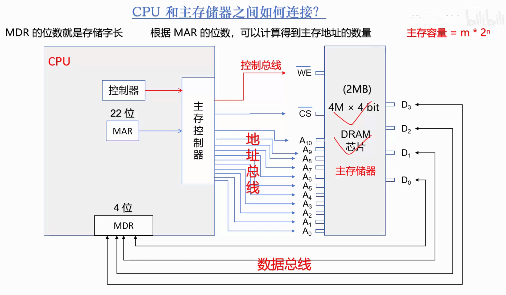


### 如何扩展主存储器的容量

根据计算存储容量的公式，如果想扩展存储器的容量，要么增加存储字长（增加一个存储字的位数），要么增加存储字数量

（1）位扩展 （2）字扩展 （3）同时增大

这里的两个存储芯片村的内容是一样的，但是输出的数据位数从4增大到了8

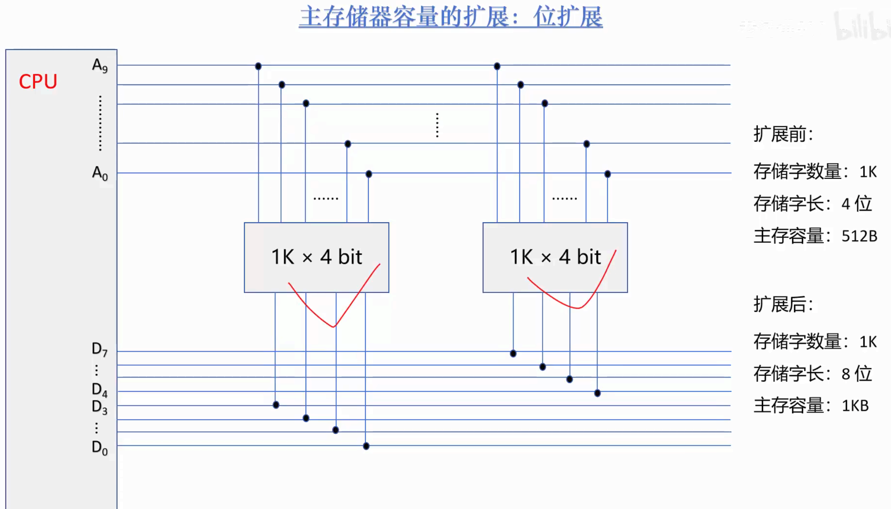


字扩展需要CS（片选信号）介入才能够实现，可以动态选择存取的存储芯片，这样就能实现增加存储芯片实现扩大存储字的效果

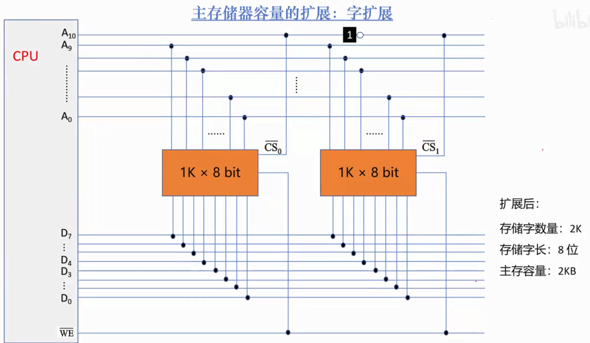
