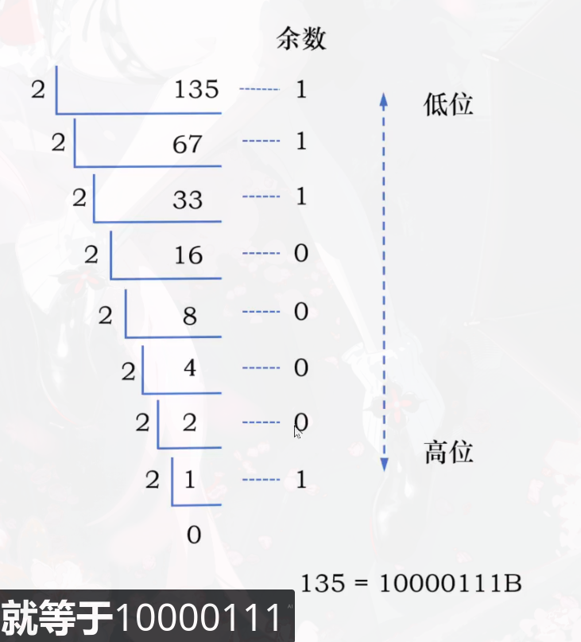

# 第一章计算机系统概述
> 如何考这方面内容?
* 基本概念: 冯诺依曼计算机结构的五个特点、程序编译的执行过程
* 性能指标的计算：CPI(每个指令执行需要的时钟周期数)、IPS(每秒执行的指令数)

用一个例子来讲解机组学什么内容，这里有一个C文件 hello.c:
```c
#include <stdio.h>
int main(){
  printf("hello world");
  return 0;
}
```

这个文件是存放在硬盘中的，在目录下执行 gcc -o hello hello.c 就会生产hello.exe的可执行程序 
这个文件当中存放的是一系列指令
当我们直接使用hello.exe命令执行它，计算机内部是这样执行程序的:

1. 在键盘中输入"hello.exe"时，这个字符串会暂时存放在键盘控制器
2. 命令解释程序(sh/cmd)会通过总线将字符串读入到CPU的寄存器中
3. CPU再通过总线把字符串存入到主寄存器中(内存条中) 
在主存中有很多存储单元，每个存储单元都有他的地址
4. 命令解释程序会从硬盘中加载hello.exe程序, 通过总线把当中的指令加载到主存中
5. CPU会从第一条指令开始，通过存储单元地址依次执行指令
6. CPU会经过一系列指令把"hello world"这个字符串通过总线送到图形控制器中将数据显示出来

目前可以把主存理解为字节数组:
下标  数据 
0       01101000
1       01101001
2       01101010
3       01101110


## 进制转换

二进制转十进制: 01101000 = 0x2^8 + 1x2^7 + 1x2^6 + ...  = 26729
1001B：后缀为B,这是个二进制数

十进制转二进制: 方法是除基取余，上右下左 



16->2 : 可以使用4个二进制位来表示一个十六进制位

16->10: 按权展开 (H是十六进制的标志)

```
13DH = 1*(16^2) + 3*(16^1) + D*(16^0) = 317
```

10->16: 同10转2


## 指令的设计和执行过程

一条指令包括 操作码+地址码

eg: 0000 0011 0000 0110 这条指令的前四位0000是操作码 剩下的是地址码

我们可以定义一个表来表示所有操作码是做什么的

| 操作码 | 操作类型 |
| ------ | -------- |
| 0000   | 取数指令 |
| 0001   | 存数指令 |
| 0010   | 加法操作 |
| 0011   | 乘法操作 |
| 0100   | 打印操作 |
| 0101   | 停机操作 |
| ...    | ....     |

如果我们想把主存地址为7的储存单元中的数据加载到1号寄存器中，就可以使用这个指令: 0000 0001 0000 0111 

0000为取数指令  0001为目的地址码：表示加载到地址为1的寄存器中

0000 0111为源操作数地址码：表示从主存地址为7的地方取数


假设我们要计算ax+b的结果，a的值为5,地址为0001 0010B, x的值为6,地址为0001 0011B, b的值为12,地址为0001 0100B

需要执行如下操作:

1. 取数，将a放到0号寄存器

   0000 0000 0001 0010

2. 取数，将x放到1号寄存器

   0000 0001 0001 0011

3. 乘法，将0号寄存器和1号寄存器的值进行乘法操作，结果存到0号寄存器

   0011 0000 0000 0001

4. 取数，将b放到1号寄存器

   0000 0001 0001 0100

5. 加法，将0号寄存器和1号进行加法操作，结果放到0号寄存器中

   0010 0000 0000 0001

6. 存数，将0号寄存器的值存入到地址为0001 0101的存储单元中

​	0001 0001 0101 0000  (目的地址码0001 0101 要在源地址码的前面)


CPU是通过内存总线和主存相连的，实际上这个总线还可以细分，一共有三类总线:

地址总线、控制总线、数据总线


CPU内部还有：

通用寄存器组

专用寄存器（程序计数器PC、指令寄存器IR、内存地址寄存器MAR、内存数据寄存器MDR)

算术逻辑单元ALU(对数据进行运算操作)

控制单元AU(用于解释主存中的指令，并发出各种操作命令)


知道 这些之后就可以把上面的程序执行流程更加细化:

第一条指令（取数，将a放到0号寄存器 0000 0000 0001 0010）：

1. 当程序的指令被加载到内存之后， 会将程序的第一条指令的地址加载到PC寄存器中
2. 控制单元AU就会同时给PC和MAR发送控制信号，把PC中的地址传送到MAR中
3. MAR中的内存地址会通过地址总线直接送到主存中
4. 控制单元AU会通过控制总线给主存发送读数据的信号
5. 主存将内存地址中的数据（这个数据其实是写程序编译成的指令）准备好后，通过数据总线传送给MDR
6. 控制单元AU会分别给MDR和IR发送控制信号，将MDR中存放的指令存放到IR中 （此时完成了取出第一条指令的操作）
7. 控制单元AU将PC的值加1或者加2，这样PC的值就会变成下一条要执行的指令的地址
8. 控制单元会分析IR中的指令的操作码，读取到是0000(取数操作)
9. 控制单元分别给IR和MAR发送控制信号，将指令中的源操作数的内存地址传输给MAR，MAR将源操作数的内存地址送到主存储器中，控制单元再给主存储器发送读数的控制信号
10. 主存将对应内存地址的数据准备好后通过数据总线把数据传送给MDR(这里的数据就是需要进行运算操作的数字了)
11. AU同时给通用寄存器组和MDR发送控制信号，将MDR中的数据传输到0号寄存器(IR中的指令中的目的地址码为0000) 

到此才完成了第一条指令的取数操作

第二条指令也是同理

第三条指令（乘法，将0号寄存器和1号寄存器的值进行乘法操作，结果存到0号寄存器）：

>  此时PC指向第三条指令的地址, 并且a的值已经存到了0号寄存器中，x的值已经存到了1号寄存器中

1. AU向PC和MAR发送控制信号，将PC中的地址传送到MAR中
2. MAR通过地址总线把地址送到主存中
3. AU会通过控制总线发送信号告诉主存读取数据，主存读取该地址中存放的指令，将该指令存放到MDR
4. AU向IR 和MDR发送信号，让MDR将数据放到IR中，这时PC会自动增加移动到下一条指令的地址
5. AU读取IR中存放的指令的操作码，发现是乘法操作
6. AU给通用寄存器组和ALU同时发送控制信号（给ALU发送的是乘法信号，将0号寄存器和1号寄存器中的值相乘，结果存到0号）

此时就完成了第三条指令的乘法操作

.....


> 总结一下整个过程
>
> 第一步都是根据PC取出指令到IR（取完之后PC自动+1），
>
> 第二步进行指令译码并送出控制型号
>
> 第三步根据不同的操作码调用不同的组件和控制信号完成指定操作


## 冯·诺依曼计算机结构的5个特点
①:计算机由运算器、控制器、存储器、输入设备和输出设备5个基本部件组成

②:指令和数据以同等地位存储在存储器中，形式上没有区别，但计算机应能区分它们

③:指令和数据均用二进制代码表示

4️⃣:指令由操作码和操作数组成两部分组成，操作数可以是多个

⑤:采用“存储程序”工作方式
